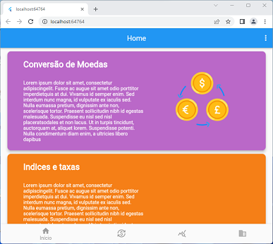
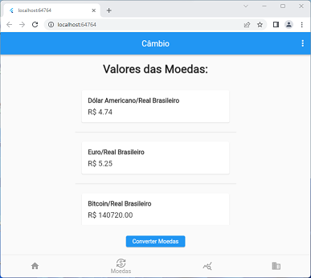
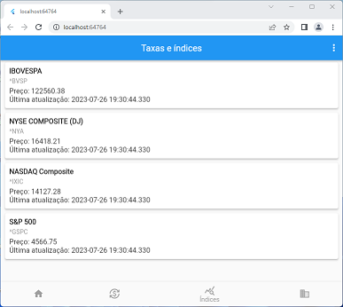
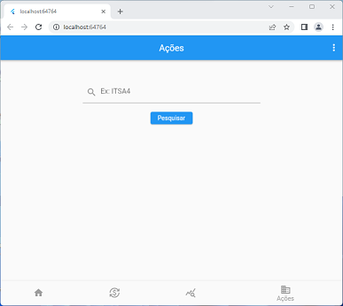

## Aplicativo de Taxas e Indicadores Financeiros

O aplicativo de Taxas e Indicadores Financeiros é uma ferramenta simples e intuitiva que permite ao usuário consultar facilmente o câmbio em diversas moedas, realizar conversões de moedas, e obter informações sobre indicadores de índices de bolsas, ações de empresas e taxas financeiras como Selic, IPCA, IGPM e CDI.

### Principais Características

+ **Câmbio em Diversas Moedas:** O aplicativo oferece uma ampla variedade de moedas para que o usuário possa consultar as taxas de câmbio em tempo real.

+  **Conversor de Moedas:** Além de consultar as taxas de câmbio, o usuário pode utilizar o conversor de moedas para realizar conversões de forma rápida e fácil.

+  **Indicadores Financeiros:** O app fornece informações atualizadas sobre os principais índices de bolsas de valores, ações de empresas e taxas financeiras relevantes para o mercado.

+ **Interface Intuitiva:** O design do aplicativo foi pensado para proporcionar uma experiência intuitiva e amigável ao usuário, tornando a consulta de informações financeiras mais acessível.

### Telas do Aplicativo

**Tela de Home**

**Tela de Câmbio**

**Tela de Indices e Taxas**

**Tela de Ações**

### Como Usar

+ Faça o download do aplicativo e instale-o em seu dispositivo móvel.

+ Ao abrir o aplicativo, você será direcionado para a tela principal, onde encontrará as opções de Câmbio, Indices e Ações.

+ Câmbio: Selecione a opção de câmbio. As moedas de câmbio atualizadas serão exibidas instantaneamente.

+ Conversor de Moedas: Para utilizar o conversor entre primeiro em Câmbio, clique no botão converter moeda, selecione a opção correspondente e insira os valores das moedas que deseja converter. O resultado da conversão será apresentado imediatamente.

+ Indices: Acesse a seção de indicadores para verificar os índices das principais bolsas de valores, consultar informações taxas financeiras relevantes, como SELIC, IGPM, CDI, IPCA.

### Tecnologias Utilizadas

O aplicativo de Taxas e Indicadores Financeiros foi desenvolvido utilizando as seguintes tecnologias:

+ **Linguagem de Programação:** Flutter, Dart, API Json;
+ **Serviço de Dados Financeiros(APIs):**
  | API | GET |
  |---|---|
  | Câmbio |  https://economia.awesomeapi.com.br/json/last/{moeda1-moeda2} |
  | Índices das Bolsas | https://brapi.dev/api/quote/{índicedabolsa} |
  | Ações | https://brapi.dev/api/quote/{nomedaação} |
  | IPCA | https://api.bcb.gov.br/dados/serie/bcdata.sgs.433/dados/ultimos/1?formato=json |
  | IGPM | https://api.bcb.gov.br/dados/serie/bcdata.sgs.189/dados/ultimos/1?formato=json |
  | SELIC | https://api.bcb.gov.br/dados/serie/bcdata.sgs.432/dados/ultimos/1?formato=json |
  | CDI | https://api.bcb.gov.br/dados/serie/bcdata.sgs.12/dados/ultimos/1?formato=json |
### Feedback e Suporte

Se você tiver alguma dúvida, sugestão ou encontrar algum problema ao utilizar o aplicativo, não hesite em entrar em contato conosco pelo e-mail suporte@suporte.com.br. Agradecemos o seu feedback e estamos sempre trabalhando para melhorar a experiência do usuário.

### Equipe de desenvolvedores

+ Aldeni Rebouças de Souza
+ Hugo Brito Chaves dos Santos
+ Lucas Longo Rebouças de Souza
+ Igor Nunes
+ Thiago Luiz Antunes Seixas

### Aviso Legal
Este aplicativo de Taxas e Indicadores Financeiros destina-se apenas a fins informativos e não oferece consultoria financeira. As informações fornecidas pelo aplicativo podem não estar atualizadas ou ser precisas. Sempre consulte fontes financeiras oficiais para obter dados confiáveis antes de tomar decisões financeiras.

Nota: As imagens utilizadas neste arquivo README.md são apenas ilustrativas e podem não representar a versão final do aplicativo, pois estamos em constante atualização.

Data de atualização do README.md: 07/2023 

